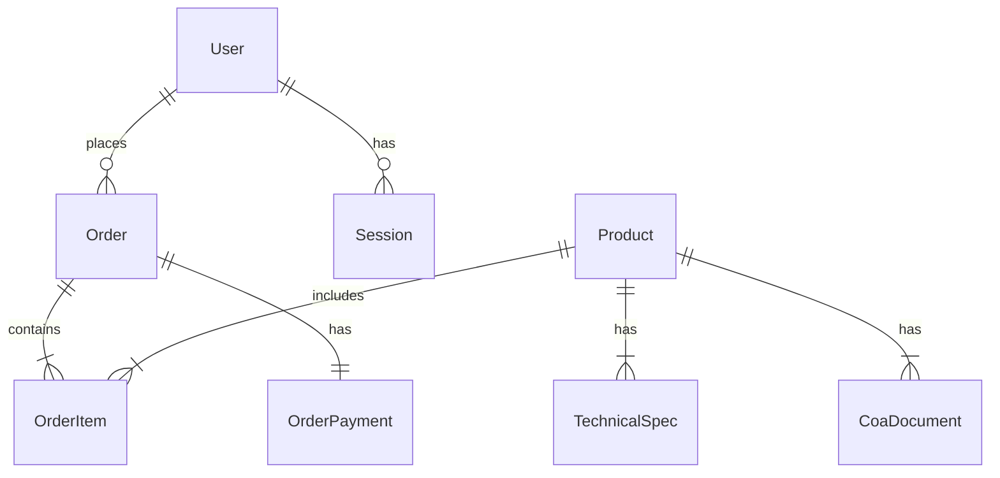

# Database Schema Documentation

This document describes the database schema for **Peptides Malaysia - Evo™**. The database is hosted on Neon (PostgreSQL) and managed via Prisma ORM.

## 📊 Overview

The schema is designed to support a typical e-commerce flow with a focus on product catalog management, order processing, and user authentication.

### Key Design Decisions
- **UUIDs:** All IDs are UUIDs (except Product IDs which are explicit slugs like `evo-retat-kit`) for security and distributed generation.
- **Decimals:** Monetary values use `Decimal(10, 2)` to prevent floating-point errors.
- **Snake Case Mapping:** Database tables and columns use `snake_case` (e.g., `user_id`, `created_at`), while the application uses `camelCase` (e.g., `userId`, `createdAt`). This is handled automatically by Prisma `@map`.
- **Soft Deletes:** Not explicitly implemented, but `isPublished` flags are used for Products and BlogPosts.

---

## 🏗️ Models

### 1. User & Authentication

#### `User`
Stores registered user accounts.
- **id**: UUID
- **email**: Unique, used for login.
- **passwordHash**: bcrypt hash.
- **role**: `customer` or `admin`.
- **orders**: Relation to Order history.

#### `Session`
Manages JWT refresh tokens.
- **refreshToken**: Long-lived token for session renewal.
- **userId**: Link to User.
- **expiresAt**: Token expiration timestamp.

---

### 2. Product Catalog

#### `Product`
The core item sold.
- **id**: String (e.g., `evo-retat-kit`). **Manual ID assignment** to keep URLs clean.
- **price** / **compareAtPrice**: Pricing logic.
- **stockQuantity**: Integer tracking inventory.
- **techSpecs**: One-to-Many relation with `TechnicalSpec`.
- **coaDocuments**: One-to-Many relation with `CoaDocument`.

#### `TechnicalSpec`
Detailed scientific data for a product.
- **productId**: Foreign key.
- **molecularFormula**, **molarMass**, etc.

#### `CoaDocument`
Certificate of Analysis files.
- **pdfUrl**: Link to the hosted PDF.
- **batchNumber**: Critical for traceability in the peptides industry.

---

### 3. Orders & Checkout

#### `Order`
Represents a customer purchase.
- **orderNumber**: Human-readable ID (e.g., `EVO-20260212-001`).
- **status**: `pending` -> `paid` -> `shipped` -> `delivered`.
- **userId**: Nullable. If null, it's a **Guest Checkout**.
- **guestName/Email**: Stored if `userId` is null.
- **payment**: One-to-One relation with `OrderPayment`.

#### `OrderItem`
Snapshot of the product at the time of purchase.
- **productPrice**: capturing the price at purchase time (immutability).
- **productName**: capturing the name at purchase time.
- **productId**: Nullable (SetNull on delete) to preserve history if product is deleted.

#### `OrderPayment`
Tracks the transaction status.
- **gateway**: `toyyibpay`, `stripe`, or `manual`.
- **status**: `pending`, `success`, `failed`.
- **rawResponse**: JSON field storing the full webhook payload for audit trails.
- **Relation:** 1:1 with Order.

---

### 4. Content Management

#### `BlogPost`
Educational content.
- **slug**: Unique URL identifier.
- **content**: Markdown or HTML.
- **isPublished**: Draft mechanism.

#### `DiscountCode`
Marketing logic.
- **code**: Unique string (e.g., `SAVE10`).
- **discountType**: `percentage` or `fixed`.
- **maxUses** / **currentUses**: Usage limits.

---

## 🔗 Relationships Diagram (Conceptual)

## 📝 Enums & Statuses

### Order Status
- `pending`: Created, awaiting payment.
- `paid`: Payment confirmed via webhook.
- `processing`: Admin acknowledged, packing.
- `shipped`: Tracking number added.
- `delivered`: Customer received.
- `cancelled`: Admin or System cancelled.
- `refunded`: Payment returned.

### Payment Status
- `pending`: Bill created.
- `success`: Webhook received '1'.
- `failed`: Webhook received '0' or error.
